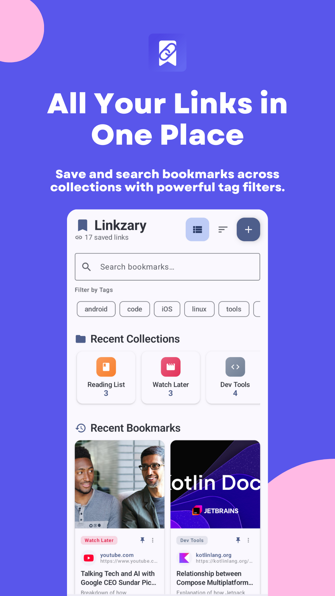
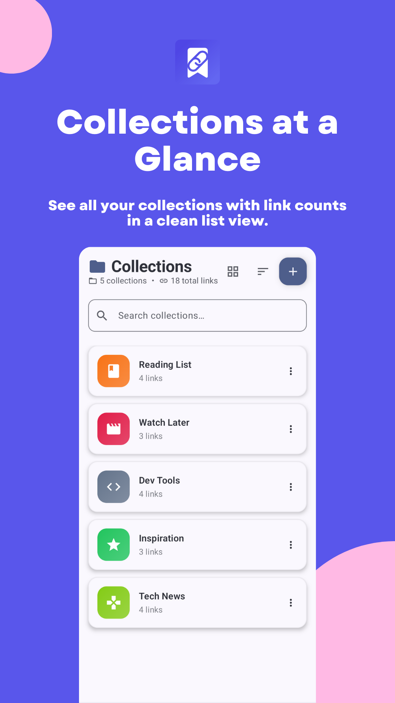
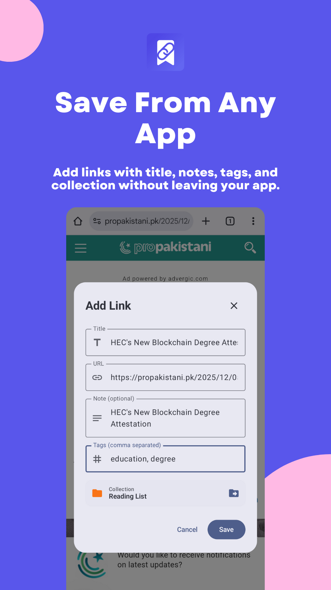

<p align="center">
  
</p>

<h1 align="center">Linkzary</h1>

<p align="center">
  <em>A clean, ad-free link &amp; bookmark manager with RSS reading, an in-app article reader, and tags/collections — built with Kotlin &amp; Jetpack Compose.</em>
</p>

<p align="center">
  No accounts · No ads · No tracking · Your data stays on your device
</p>

<p align="center">
  <a href="https://play.google.com/store/apps/details?id=com.appcodecraft.linkzary&hl=en">
    
  </a>
</p>

<p align="center">
  <a href="https://github.com/ZaryabKhan/Linkzary/actions/workflows/build.yml"></a>
  <a href="https://github.com/ZaryabKhan/Linkzary/releases/latest"></a>
  <a href="https://github.com/ZaryabKhan/Linkzary/releases"></a>
  <a href="https://github.com/ZaryabKhan/Linkzary/stargazers"></a>
  <a href="https://github.com/ZaryabKhan/Linkzary/forks"></a>
  <br />
  <a href="https://opensource.org/licenses/MIT"></a>
  
  
  
  
  
  <a href="https://github.com/ZaryabKhan/Linkzary/issues"></a>
  <a href="https://github.com/ZaryabKhan/Linkzary/pulls"></a>
  <a href="CONTRIBUTING.md"></a>
  <a href="https://github.com/ZaryabKhan/Linkzary/graphs/contributors"></a>
  <a href="https://github.com/ZaryabKhan/Linkzary/blob/master/SECURITY.md"></a>
</p>

<p align="center">
  <sub>Jump to: <a href="#-features">Features</a> · <a href="#-screenshots">Screenshots</a> · <a href="#%EF%B8%8F-tech-stack">Tech Stack</a> · <a href="#-getting-started">Getting Started</a> · <a href="#-contributing">Contributing</a> · <a href="#-security">Security</a> · <a href="#-license">License</a></sub>
</p>

---

## ✨ Features

Linkzary helps you **save, organize, and read the web** — without accounts, ads, or tracking.

| | Feature | Description |
|---|---|---|
| 🔖 | **Smart link saving** | Save any URL with automatic title, favicon, and preview-image extraction. |
| 📁 | **Collections** | Group related links into themed collections with custom icons. |
| 🏷️ | **Tags** | Organize links with tags and bulk multi-select actions. |
| 📰 | **RSS feeds** | Subscribe to and read your favorite feeds in one place. |
| 📖 | **Article reader** | A distraction-free reader that extracts the main content from articles. |
| 📶 | **Offline mode** | Saved links automatically extract and store article content for offline reading. |
| 🩺 | **Link health checks** | A background worker periodically checks whether saved links are still reachable. |
| 🧾 | **Metadata previews** | Rich previews (title, favicon, preview image) for every saved link. |
| 💾 | **Import / Export** | Back up and restore your data via JSON or CSV. |
| 🎨 | **Material 3 themes** | Light, dark, and system themes with dynamic color support. |
| 🌍 | **Multi-language** | English, Arabic, German, Spanish, French, Italian, and Portuguese. |
| 💝 | **Optional donations** | In-app donations via Google Play Billing. The app is and will remain **free**. |
| 🚫 | **No ads · No analytics · No accounts** | Your data never leaves your device. |

## 📸 Screenshots

<p align="center">
  <table>
    <tr>
      <td align="center"><br/><sub>Home — Saved links</sub></td>
      <td align="center"><br/><sub>Reader — Distraction-free</sub></td>
      <td align="center"><br/><sub>Collections</sub></td>
      <td align="center"><br/><sub>Share — Quick save</sub></td>
    </tr>
  </table>
</p>

> Captures are stored in [`docs/images/`](docs/images/). Add more by dropping files there and referencing them above.

## 🛠️ Tech stack

| Layer | Technology |
|---|---|
| 💻 Language | [Kotlin](https://kotlinlang.org/) |
| 🎨 UI | [Jetpack Compose](https://developer.android.com/jetpack/compose) · [Material 3](https://m3.material.io/) |
| 🏛️ Architecture | **MVVM** + [Hilt](https://dagger.dev/hilt/) dependency injection |
| 🗃️ Database | [Room](https://developer.android.com/training/data-storage/room) |
| ⚙️ Background | [WorkManager](https://developer.android.com/jetpack/androidx/releases/work) for link-health checks |
| 🌐 Network | [OkHttp](https://square.github.io/okhttp/) · [Jsoup](https://jsoup.org/) · RSS Parser |
| 🖼️ Images | [Coil](https://coil-kt.org/) |
| 💳 Payments | [Google Play Billing](https://developer.android.com/google/play/billing) (donations only) |
| 🔧 Serialization | [kotlinx.serialization](https://github.com/Kotlin/kotlinx.serialization) |
| 🧪 Testing | JUnit · AndroidX Test · Espresso · Compose UI Test |

<details>
<summary><strong>📦 Full dependency list</strong></summary>

- `androidx.core:core-ktx`
- `androidx.lifecycle:lifecycle-runtime-ktx`, `lifecycle-viewmodel-compose`, `lifecycle-runtime-compose`
- `androidx.activity:activity-compose`
- AndroidX Compose BOM + `ui`, `ui-graphics`, `ui-tooling-preview`, `material3`, `material-icons-extended`
- `androidx.navigation:navigation-compose`
- `androidx.room:room-runtime`, `room-ktx`
- `com.google.dagger:hilt-android` + `androidx.hilt:hilt-navigation-compose`, `hilt-work`
- `org.jetbrains.kotlinx:kotlinx-coroutines-android`
- `org.jetbrains.kotlinx:kotlinx-serialization-json`
- `com.squareup.okhttp3:okhttp`
- `org.jsoup:jsoup`
- `com.prof18.rssparser:rssparser`
- `androidx.work:work-runtime-ktx`
- `io.coil-kt:coil-compose`
- `com.android.billingclient:billing-ktx`
- `com.android.tools:desugar_jdk_libs` (core library desugaring)

</details>

## 📋 Requirements

- **Android Studio** with AGP 9.x / Gradle 9.3 support
- **JDK 17** or newer
- **Android SDK 36** (`compileSdk = 36`, `minSdk = 26`, `targetSdk = 36`)

## 🚀 Getting started

```bash
# 1. Clone the repository
git clone https://github.com/ZaryabKhan/Linkzary.git
cd Linkzary

# 2. Build a debug APK
./gradlew assembleDebug

# 3. Run unit tests
./gradlew test

# 4. Open in Android Studio and run on a device/emulator
```

The debug APK will be at `app/build/outputs/apk/debug/app-debug.apk`.

<details>
<summary><strong>🔧 JDK note for CLI builds</strong></summary>

The project does **not** ship a machine-specific `org.gradle.java.home` in version control, so command-line builds use the JDK on your `JAVA_HOME`/`PATH`. To pin a specific JDK for local CLI builds, set:

```
org.gradle.java.home=...
```

…in `~/.gradle/gradle.properties` (user-level, **not** committed).
</details>

## 🧭 Project structure

```
app/
└── src/
    ├── main/
    │   ├── java/com/appcodecraft/linkzary/
    │   │   ├── billing/      # Google Play Billing (donations)
    │   │   ├── data/         # Room database, entities, DAOs, repositories
    │   │   │   ├── converter/   # Room type converters
    │   │   │   ├── dao/         # Data access objects
    │   │   │   ├── database/    # Room database definition + migrations
    │   │   │   ├── entity/      # Room entities (SavedLink, Collection, RssFeed)
    │   │   │   ├── model/       # Import/export data models
    │   │   │   ├── preferences/ # User preferences manager
    │   │   │   ├── repository/  # Repositories (Link, Collection, Rss)
    │   │   │   └── service/     # Import/export service (JSON & CSV)
    │   │   ├── di/          # Hilt modules (Database, Network, Preferences)
    │   │   ├── navigation/  # Compose navigation graph
    │   │   ├── ui/          # Compose screens, ViewModels, theme
    │   │   │   ├── activity/   # MainActivity, ShareActivity
    │   │   │   ├── component/  # Reusable Compose components
    │   │   │   ├── screen/     # Feature screens (home, reader, rss, collections, settings, stats, tags, donation, share)
    │   │   │   └── theme/      # Material 3 colors, typography, themes
    │   │   ├── util/        # Article & URL metadata extraction (Jsoup/OkHttp)
    │   │   ├── utils/       # LocaleHelper
    │   │   └── worker/      # WorkManager link-health checks
    │   └── res/            # Icons, strings (i18n: ar/de/es/fr/it/pt), themes, XML config
    ├── androidTest/        # Instrumentation tests
    └── test/               # Unit tests
```

## 🤝 Contributing

Contributions are welcome! Please read [CONTRIBUTING.md](CONTRIBUTING.md) to learn how to set up the project and submit pull requests.

Looking for a good place to start? Check for issues labeled [`good first issue`](https://github.com/ZaryabKhan/Linkzary/labels/good%20first%20issue) and [`help wanted`](https://github.com/ZaryabKhan/Linkzary/labels/help%20wanted).

```bash
# Fork → Branch → Commit → PR
git checkout -b feat/my-awesome-feature
```

<details>
<summary><strong>📜 Code of conduct</strong></summary>

By participating you agree to abide by the [Code of Conduct](CODE_OF_CONDUCT.md). Be kind and respectful.
</details>

## 🔒 Security

Found a vulnerability? Please **do not** open a public issue. See [SECURITY.md](SECURITY.md) for how to report it privately.

## 📝 Changelog

See the [Releases](https://github.com/ZaryabKhan/Linkzary/releases) page for version history.

## 📜 License

Linkzary is licensed under the **MIT License** — see [LICENSE](LICENSE).

---

<p align="center">
  Built with ❤️ by <a href="https://github.com/ZaryabKhan">Zaryab Khan</a> &amp; <a href="https://github.com/ZaryabKhan/Linkzary/graphs/contributors">contributors</a>.<br/>
  If Linkzary is useful to you, consider ⭐ starring the repo or donating via the in-app donations screen to support development.
</p>

<p align="center">
  <sub>
    <a href="https://github.com/ZaryabKhan/Linkzary/issues/new?labels=bug&template=bug_report.md">Report a bug</a> ·
    <a href="https://github.com/ZaryabKhan/Linkzary/issues/new?labels=enhancement&template=feature_request.md">Request a feature</a> ·
    <a href="https://github.com/ZaryabKhan/Linkzary/discussions">Discussions</a>
  </sub>
</p>